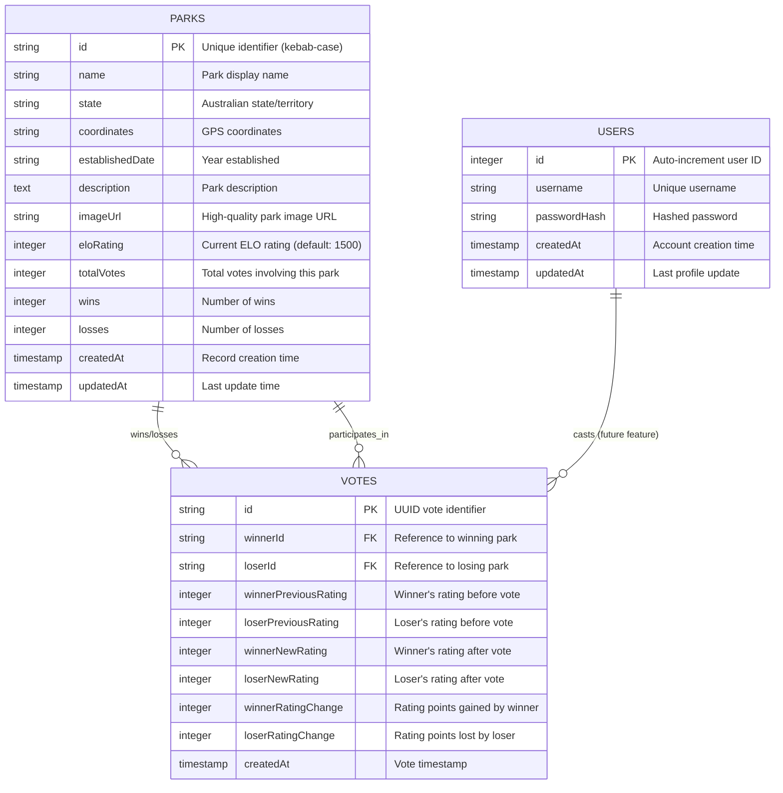
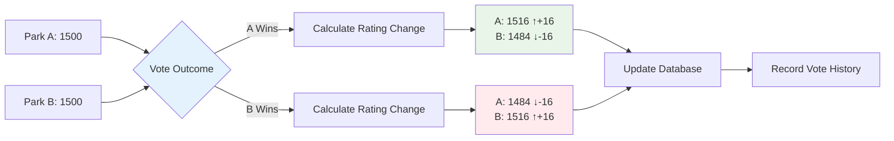
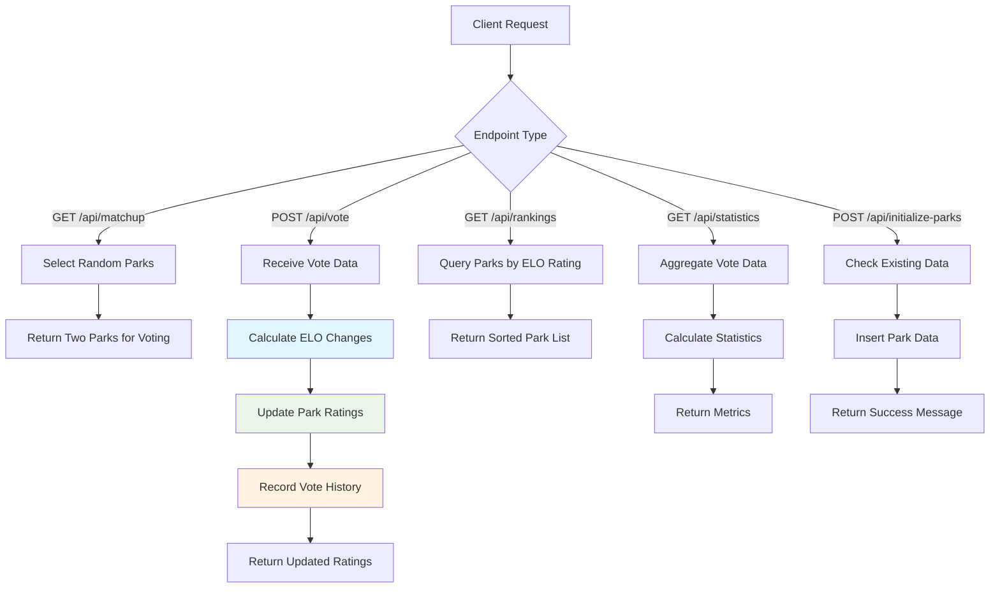

# Australian National Parks Voting Application

## Overview

This is a full-stack web application that allows users to vote on Australian national parks in head-to-head matchups using an ELO rating system. Users can compare parks and see real-time rankings based on community voting. The application features a modern React frontend with shadcn/ui components and an Express.js backend with PostgreSQL database storage.

## User Preferences

Preferred communication style: Simple, everyday language.

## System Architecture

### Frontend Architecture
- **Framework**: React 18 with TypeScript
- **Routing**: Wouter for client-side routing
- **UI Components**: shadcn/ui component library with Radix UI primitives
- **Styling**: Tailwind CSS with custom CSS variables for theming
- **State Management**: TanStack Query (React Query) for server state management
- **Build Tool**: Vite for development and production builds

### Backend Architecture
- **Framework**: Express.js with TypeScript
- **API Design**: RESTful API with JSON responses
- **Database ORM**: Drizzle ORM for type-safe database operations
- **Database**: PostgreSQL with Neon serverless connection
- **Session Management**: Express sessions with PostgreSQL storage via connect-pg-simple
- **Error Handling**: Centralized error handling middleware
- **Logging**: Custom request/response logging middleware

### Database Schema

The application uses a PostgreSQL database with three main entities designed for the ELO rating voting system:



#### Schema Details

**Parks Table**
- Primary entity storing all Australian national park information
- ELO rating system with 1500 starting rating for all parks
- Comprehensive metadata including establishment dates and coordinates
- Vote statistics tracking for analytics and leaderboards

**Votes Table** 
- Records complete voting history with before/after ratings
- Enables ELO calculation verification and historical analysis
- Stores rating changes for statistics and trending analysis
- Foreign key relationships to parks for winner/loser tracking

**Users Table**
- Authentication system (currently not fully implemented)
- Designed for future features like user profiles and voting history
- Prepared for user-specific analytics and preferences

#### Relationships
- Each vote references exactly two parks (winner and loser)
- Parks can participate in unlimited votes over time
- Rating changes are calculated using standard ELO algorithm (K-factor: 32)
- All historical data preserved for analysis and rating recalculation

### ELO Rating System

The application implements a chess-style ELO rating system for ranking national parks based on head-to-head vote outcomes:



**Algorithm Details:**
- **Starting Rating**: All parks begin with 1500 points (industry standard)
- **K-Factor**: 32 (determines rating volatility - higher = more dramatic changes)
- **Expected Score Formula**: `E = 1 / (1 + 10^((RatingB - RatingA) / 400))`
- **New Rating Formula**: `NewRating = OldRating + K * (ActualScore - ExpectedScore)`

**Rating Dynamics:**
- Underdog victories result in larger rating swings
- Closely matched parks see smaller rating changes  
- System naturally converges toward accurate rankings over time
- All rating changes are symmetric (winner gains = loser loses)

**Implementation Benefits:**
- Self-balancing system requires minimal manual adjustment
- Handles new parks entering the system gracefully
- Historical vote data enables rating recalculation if needed
- Provides intuitive ranking that reflects community preferences

### API Endpoints



**Core API Endpoints:**
- `GET /api/matchup` - Returns two random parks for head-to-head comparison
- `POST /api/vote` - Submits a vote and updates ELO ratings with full history tracking
- `GET /api/rankings` - Returns parks sorted by ELO rating (supports state filtering)
- `GET /api/statistics` - Returns comprehensive voting statistics and metrics
- `POST /api/initialize-parks` - Seeds database with initial park data (idempotent)

**API Response Examples:**
```typescript
// GET /api/matchup
{
  parks: [
    { id: "kakadu-national-park", name: "Kakadu National Park", ... },
    { id: "uluru-kata-tjuta-national-park", name: "Uluru-Kata Tjuta National Park", ... }
  ]
}

// POST /api/vote (body: { winnerId, loserId })
{
  message: "Vote recorded successfully",
  ratingChanges: {
    winner: { previous: 1520, new: 1536, change: +16 },
    loser: { previous: 1480, new: 1464, change: -16 }
  }
}

// GET /api/rankings
{
  rankings: [
    { id: "...", name: "...", eloRating: 1650, wins: 23, losses: 8, ... }
  ]
}

// GET /api/statistics  
{
  totalVotes: "1247",
  todayVotes: "23", 
  totalParks: "41",
  mostContested: "Blue Mountains National Park"
}
```

### Data Management
- Significantly expanded park dataset representing major parks from Australia's 600+ national parks system
- Comprehensive coverage across all states and territories with authentic park information
- Queensland leads with 8 major parks (from 237+ total), NSW with 11 major parks (from 200+ total)
- Vote history is maintained for analytics and rating recalculation
- Real-time updates to rankings after each vote
- Statistics tracking including daily vote counts and most contested parks

## External Dependencies

### Database Services
- **Neon Database**: Serverless PostgreSQL database hosting
- **Drizzle Kit**: Database migration and schema management tools

### UI and Styling
- **Radix UI**: Accessible component primitives for complex UI elements
- **Tailwind CSS**: Utility-first CSS framework for styling
- **Lucide Icons**: Icon library for consistent iconography
- **Class Variance Authority**: Utility for managing component variants

### Development Tools
- **Vite**: Fast build tool and development server
- **TypeScript**: Type safety and enhanced developer experience
- **ESBuild**: Fast JavaScript bundler for production builds
- **Replit Integration**: Development environment plugins and error overlays

### Data Processing
- **Date-fns**: Date manipulation and formatting utilities
- **TanStack Query**: Server state management and caching
- **React Hook Form**: Form state management and validation
- **Zod**: Runtime type validation and schema parsing